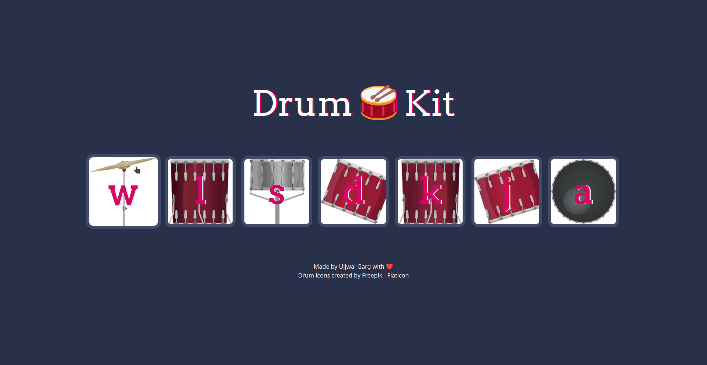
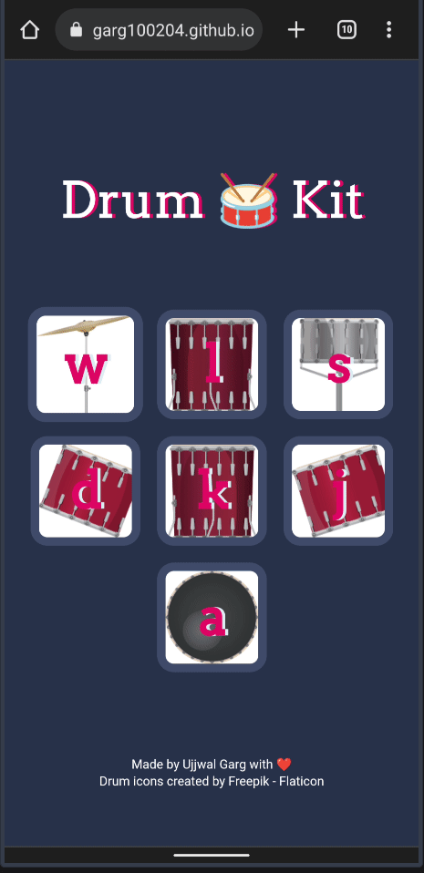

<!-- Improved compatibility of back to top link: See: https://github.com/othneildrew/Best-README-Template/pull/73 -->

<!-- PROJECT SHIELDS -->

[![Stargazers][stars-shield]][stars-url]
[![MIT License][license-shield]][license-url]
[![LinkedIn][linkedin-shield]][linkedin-url]

<!-- PROJECT LOGO -->
 

  

<h3 align="center">Drum Kit</h3>

  

    The minimalist drum kit website designed with responsiveness in mind. Explore the simplicity of six distinct sounds, crafted to bring rhythm and creativity to your fingertips.
     
    <a href="https://github.com/ujjwalgarg100204/Vanilla-JS-Drum-Kit"><strong>Explore the docs »</strong></a>
     
     
    <a href="https://ujjwalgarg100204.github.io/Vanilla-JS-Drum-Kit">View Demo</a>
    ·
    <a href="https://github.com/ujjwalgarg100204/Vanilla-JS-Drum-Kit/issues">Report Bug</a>
    ·
    <a href="https://github.com/ujjwalgarg100204/Vanilla-JS-Drum-Kit/issues">Request Feature</a>
  

<!-- TABLE OF CONTENTS -->

  
Table of Contents

  <ol>
    <li>
      <a href="#about-the-project">About The Project</a>
      <ul>
        <li><a href="#built-with">Built With</a></li>
      </ul>
    </li>
    <li><a href="#contributing">Contributing</a></li>
    <li><a href="#license">License</a></li>
    <li><a href="#contact">Author</a></li>
  </ol>

<!-- ABOUT THE PROJECT -->

## About The Project

Experience the essence of rhythm with Drum Kit, a responsive drum kit website powered by Tailwind CSS. Embrace the beauty of simplicity as you explore our carefully curated selection of drum kits, each capable of producing only six unique and captivating sounds. Unleash your creativity within this minimalist setup, where every beat counts and simplicity becomes the catalyst for musical innovation. Whether you're a beginner or a seasoned drummer, DrumEssentials offers an immersive and focused drumming experience like no other. Let the limited sound palette ignite your passion for percussive expression and take your drumming skills to new heights.

#### Desktop Design

  

#### Mobile Design

	 

(<a href="#readme-top">back to top</a>)

### Built With

-   [![Tailwind][tailwind-shield]][tailwind-url]
-   [![JavaScript][js-sheild]][javascript-url]

(<a href="#readme-top">back to top</a>)

<!-- CONTRIBUTING -->

## Contributing

Contributions are what make the open source community such an amazing place to learn, inspire, and create. Any contributions you make are **greatly appreciated**.

If you have a suggestion that would make this better, please fork the repo and create a pull request. You can also simply open an issue with the tag "enhancement".
Don't forget to give the project a star! Thanks again!

1. Fork the Project
2. Create your Feature Branch (`git checkout -b feature/AmazingFeature`)
3. Commit your Changes (`git commit -m 'Add some AmazingFeature'`)
4. Push to the Branch (`git push origin feature/AmazingFeature`)
5. Open a Pull Request

(<a href="#readme-top">back to top</a>)

<!-- LICENSE -->

## License

Distributed under the MIT License. See `LICENSE.txt` for more information.

(<a href="#readme-top">back to top</a>)

## Links

-   Repo URL: [https://github.com/ujjwalgarg100204/Vanilla-JS-Drum-Kit](https://github.com/ujjwalgarg100204/Vanilla-JS-Drum-Kit)
-   Live Site URL: [https://ujjwalgarg100204.github.io/Vanilla-JS-Drum-Kit](https://ujjwalgarg100204.github.io/Vanilla-JS-Drum-Kit)

<!-- AUTHOR -->

## Author

-   Website - [Ujjwal Garg](https://github.com/ujjwalgarg100204)
-   Instagram - [@ujjwalgarg100204](https://www.instagram.com/ujjwalgarg100204/)
-   Linkedin - [@ujjwalgarg100204](https://www.linkedin.com/in/ujjwal-garg-3a5639243/)
-   Twitter -[@UjwalGarg100204](https://twitter.com/UjwalGarg100204)

(<a href="#readme-top">back to top</a>)

<!-- MARKDOWN LINKS & IMAGES -->
<!-- https://www.markdownguide.org/basic-syntax/#reference-style-links -->

[stars-shield]: https://img.shields.io/github/stars/ujjwalgarg100204/Vanilla-JS-Drum-Kit.svg?style=for-the-badge
[stars-url]: https://github.com/ujjwalgarg100204/Vanilla-JS-Drum-Kit/stargazers
[license-shield]: https://img.shields.io/github/license/ujjwalgarg100204/Vanilla-JS-Drum-Kit.svg?style=for-the-badge
[license-url]: https://github.com/ujjwalgarg100204/Vanilla-JS-Drum-Kit/blob/master/LICENSE.txt
[linkedin-shield]: https://img.shields.io/badge/-LinkedIn-black.svg?style=for-the-badge&logo=linkedin&colorB=555
[linkedin-url]: https://www.linkedin.com/in/ujjwal-garg-3a5639243
[desktop-view-screenshot]: ./screenshots/desktop-view.png
[mobile-view-screenshot]: ./screenshots/mobile-view.png
[tailwind-shield]: https://img.shields.io/badge/Tailwind_CSS-38B2AC?style=for-the-badge&logo=tailwind-css&logoColor=white
[tailwind-url]: https://tailwindcss.com
[js-sheild]: https://img.shields.io/badge/JavaScript-F7DF1E?style=for-the-badge&logo=javascript&logoColor=black
[javascript-url]: https://developer.mozilla.org/en-US/docs/Web/JavaScript
