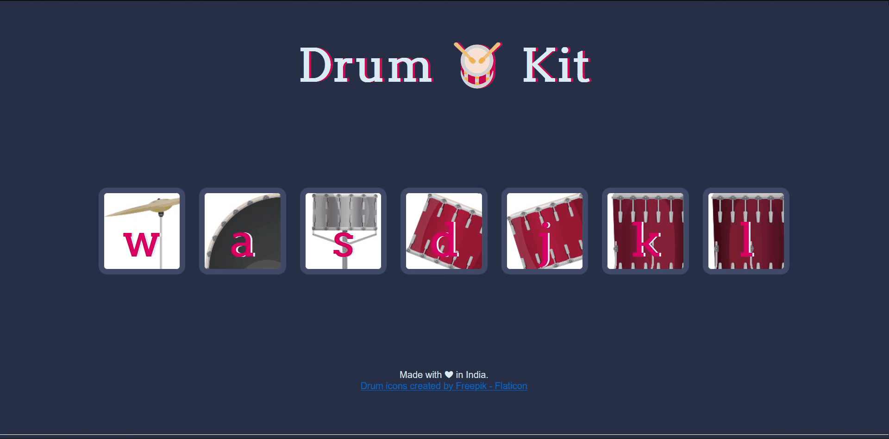

# Drum Kit

Project using Vanilla JS to make drum sounds whenever drums are clicked.
Made as a part of
Course [2022 Web Development Bootcamp](https://www.udemy.com/course/the-complete-web-development-bootcamp/)
by [Dr. Angela Yu](https://www.linkedin.com/in/angela-yu1/)



## Features

- Whenever each image is clicked or key corresponding to each drum is pressed, respective sound is played

## Installation / Cloning

```bash
git clone https://github.com/ujjwalgarg100204/Drum-kit.git 
```

## Usage

Open ```index.html``` with any popular browser, and it should work

## Contributing

Although, there is little to no scope for contributing, pull requests are welcome. For major changes, please open an
issue first to discuss what you would like to change.

## License

[MIT](LICENSE.txt)